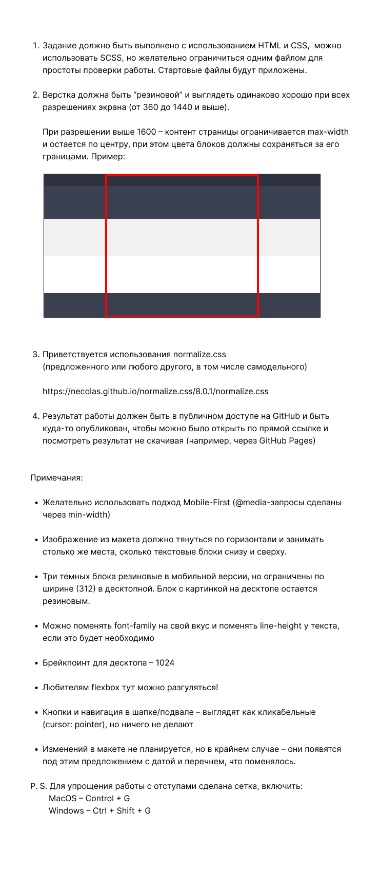

RDCLR.SCHOOL week2 task1 - страница по макету из Figma.

- HTML, CSS

- mobile first  

- резиновая семантическая верстка

- breakpoint на 1024px

- макет для мобильной версии - 360px, макет для десктопа - 1440px 

- контент ограничивается при разрешении экрана больше 1600px, цвета блоков тянутся на всю ширину вьюпорта

- анимированная кнопка и навигация в шапке/подвале

https://iuliia-bogdanova.github.io/this-ptoduct/  

